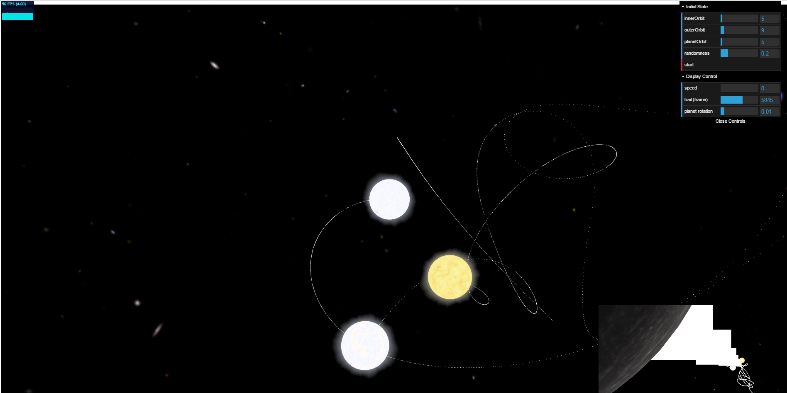
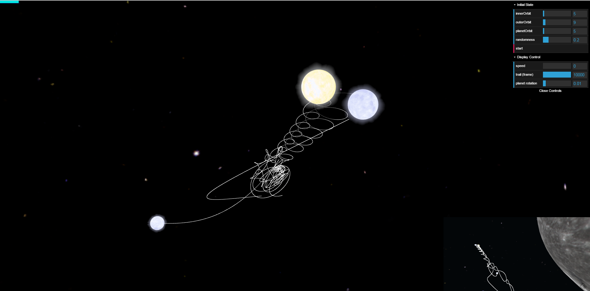
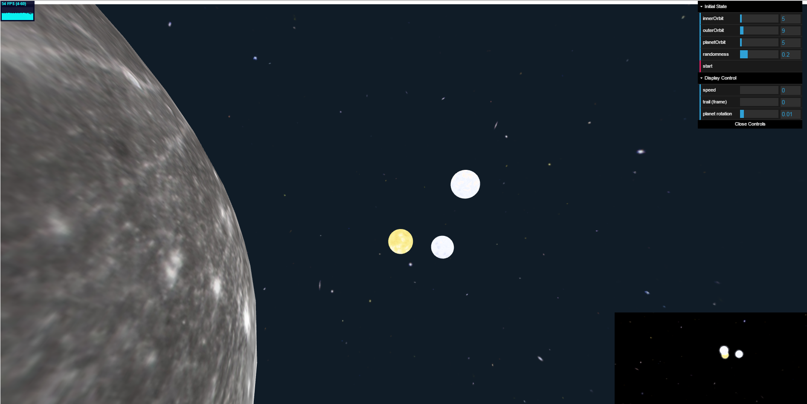
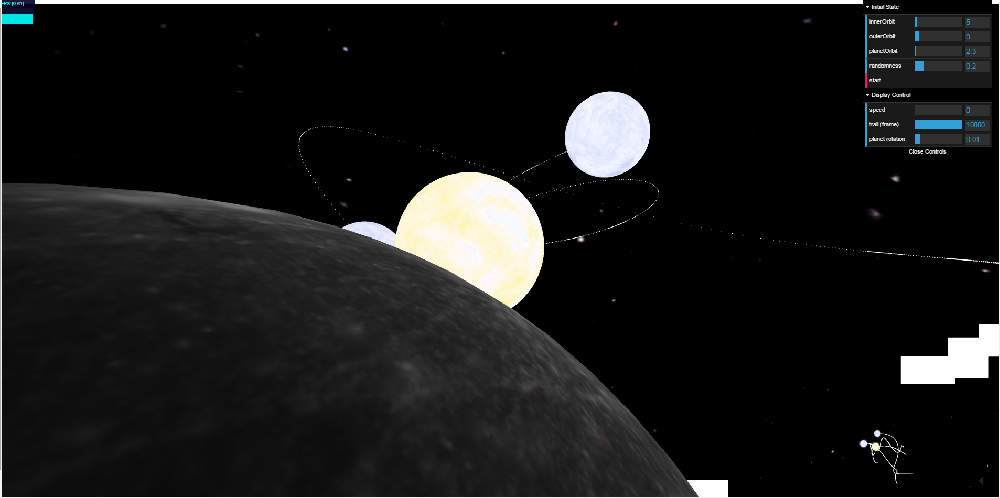

# Three Body

## Launch in Browser
https://leav.github.io/three-body/

## Description

This project idea is from the science fiction [*Three Body*][1]. In this simulation, a planet is orbiting around a [triple star system][2], where the planet has three suns. Because of the unpredictable nature of the three body system, chaos things happen, such as one of the sun getting ejected off, or the planet being consumed by the suns.

Inside the simulation, you can set various initial conditions for the star system. Press and drag the mouse to rotate the camera. Use mouse wheel to zoom. Click on the small screen at the right bottom corner to switch between stellar view and planetary view.

To run the demo locally, please refer to [this page](https://github.com/mrdoob/three.js/wiki/How-to-run-things-locally). Otherwise, the security setting of the browser would not let you load the textures.

## Screenshots

### Stellar View

### Planetary View

## Credits

sun texture: [NASA][13]

space texture: [NASA][14]

planet texture (Mercury): [NASA][15]

  [1]: http://en.wikipedia.org/wiki/Three_Body_%28science_fiction%29 "wikipedia: Three Body"
  [2]: https://en.wikipedia.org/wiki/Multiple_star#Triple_star_systems
  [13]: http://www.nasa.gov
  [14]: http://www.nasa.gov
  [15]: http://www.nasa.gov
